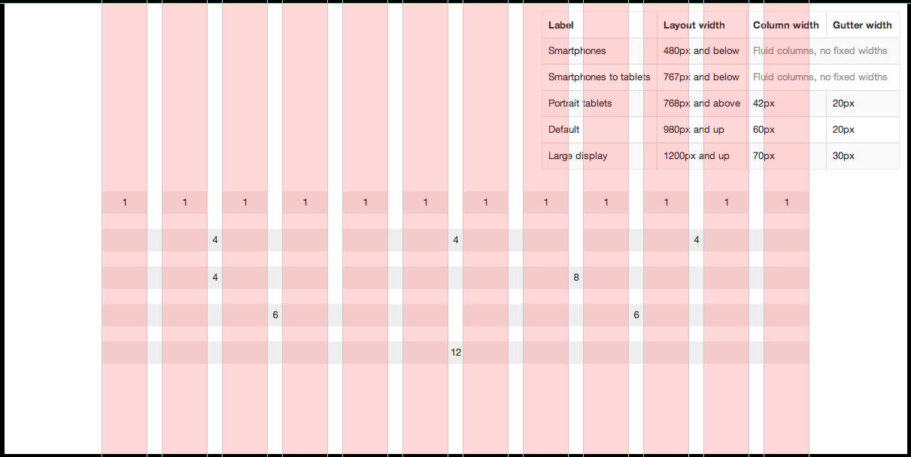

# Grille et dispositions



Ce n'est plus un secret, réaliser une maquette en HTML n'est pas une sinécure. Il faut maîtriser les règles de positionnement (`display`, `position`, `float`) mais surtout savoir jongler avec le [modèle de boîte du navigateur](http://www.w3.org/TR/CSS2/box.html).


[Une petite piqure de rappel ?](http://fr.learnlayout.com/)


> **Hint** Heureusement, Boostrap utilise en interne le modèle de boîte basé sur les bordure :

> ```css
*
{
  -webkit-box-sizing: border-box;
     -moz-box-sizing: border-box;
          box-sizing: border-box;
}
```

## Mobile first

> **Note** Il faut bien comprendre l'orientation prise par Booststrap : Par défaut, tous les éléments doivent occuper la largeur totale de leur conteneur parent. C'est ensuite en appliquant des règles supplémentaires, que l'on obtiendra des dispositions en colonnes.

Nous disposons de 4 classes pour cela :

- `col-xs-*` : smartphone avec une surface < `768px`
- `col-sm-*` : tablettes > `768px`
- `col-md-*` : ordinateurs > `992px`
- `col-lg-*` : écrans larges > `1200px`

La grille de Bootstrap se ventile sur 12 colonnes.

1. Pour cela incluez tout d'abord vos blocs dans un conteneur ayant la classe `.row`.
2. Répartissez la largeur des colonnes en choisissant une valeur entre 1 et 12.
3. A vos calculettes ! Il va falloir que le résultat des largeur de colonnes fasse 12.
4. **Recommencez, imbriquez, recommencez, décalez !**

> **Hint** Va t-il falloir appliquer 4 styles pour toutes les largeurs d'écrans ?

> Non, bien sûr. La plupart du temps, l'affichage par défaut se comportera correctement. N'appliquez une règle que pour spécialiser un affichage spécifique à un terminal.

Si vous souhaitez avoir deux colonnes à partir d'un écran d'ordinateur de bureau :

```html
<div class="row">
    <div class="col-md-6">A gauche toute</div>
    <div class="col-md-6">A droite toute</div>
</div>
```


Si au contraire, c'est **à partir** d'un écran de mobile, vous appliquerez plmutôt les règles ainsi :

```html
<div class="row">
    <div class="col-xs-6">A gauche toute</div>
    <div class="col-xs-6">A droite toute</div>
</div>
```

> **Note** Pensez mobile first. C'est-à-dire, par étapes, du mobile vers les grands écrans. De bas en haut, quoi.

Il va de soi que vous pouvez mixer plusieurs règles au sein du même code :

```html
<div class="row">
    <div class="col-xs-4 col-md-6">A gauche toute</div>
    <div class="col-xs-8 col-md-6">A droite toute</div>
</div>
```

## Imbriquez

N'hésitez pas à inclure des conteneurs au sein d'autres conteneurs. La largeur du parent sera la largeur totale des éléments inclus.


## Décallez

Besoin d'un petit décallage ? Pas de soucis.

Vous avez à disposition les classes `.col-(xs|sm|md|lg)-offset-(largeur)`

## Poussez, tirez !

- Si la sémantique de votre contenu impose un ordre différent de votre affichage, pas de problème.
- Si vous voulez organiser les blocs différemment entre la version mobile et la version PC, c'est posssible aussi…

Les classes `.col-(xs|sm|md|lg)-push-*` et `.col-(xs|sm|md|lg)-pull-*` sont à votre disposition.

> **Comment** Quelle flexibilité tout de même.


## Maquette photoshop

Vous pouvez vous procurer un [modèle de grille photoshop](http://benstewart.net/2012/06/bootstrap-responsive-photoshop-templates/) pour réaliser vos maquettes.

## Atelier d'integration en grilles

 Cruciverbistes à votre éditeurs de code !

